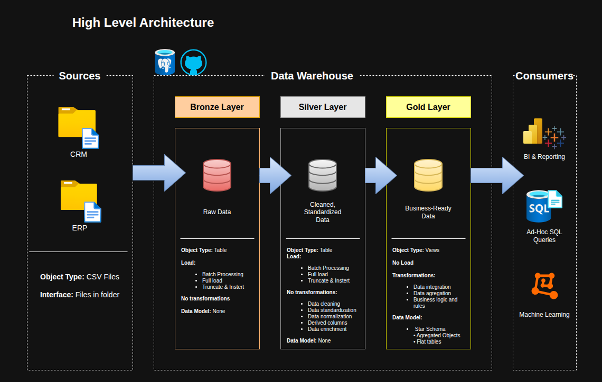

# Olist Data Warehouse

An end-to-end data warehouse project built on the **Olist Brazilian E-Commerce** public dataset. This project demonstrates modern data engineering practices, from raw data ingestion to analytical-ready models, following a **Medallion Architecture** (Bronze → Silver → Gold) implemented in **PostgreSQL**.

> Built as a portfolio project to showcase data engineering skills including SQL development, ETL pipeline design, dimensional modeling, data quality practices, and cloud migration planning.

---

## Data Architecture

This project follows the **Medallion Architecture** pattern with three distinct layers:



| Layer | Description | Object Type | Load Strategy |
|---|---|---|---|
| **Bronze** | Raw data ingested as-is from source CSV files | Tables | Full load - Truncate & Insert |
| **Silver** | Cleaned, standardized and normalized data | Tables | Full load - Truncate & Insert |
| **Gold** | Business-ready analytical models | Views | No load - Derived from Silver |

---

## Layer Details

### Bronze - Raw Ingestion

Loads all 9 Olist CSV source files into PostgreSQL as-is with no transformations applied. All columns are stored as `VARCHAR` to preserve raw data integrity. Type casting or cleaning at ingestion could silently corrupt or reject records, Bronze is the safety net.

- **Load strategy:** Full load - Truncate & Insert
- **Object type:** Tables
- **Scripts:** `scripts/bronze/ddl_bronze.sql`, `scripts/bronze/load_bronze.sql`

> `crm_order_reviews` required a Python-based ingestion script (`import_reviews.py`) due to special characters and line breaks in customer comment fields causing CSV parsing failures.

---

### Silver - Cleaning & Standardization

Transforms Bronze data into clean, typed and consistent tables ready for dimensional modeling. No joins or business logic are applied at this stage, Silver tables maintain a 1:1 relationship with their Bronze counterparts.

Key transformations applied:

| Area | Transformation |
|---|---|
| Data types | All columns cast to proper types (TIMESTAMP, DECIMAL, INTEGER) |
| String standardization | City names lowercased and trimmed, state codes uppercased |
| ZIP codes | Padded to 5 characters using `LPAD` across customers, sellers and geolocation |
| Column renames | Typos corrected in `erp_products` (`lenght` → `length`) |
| Null handling | Empty strings converted to NULL, delivery date nulls preserved intentionally |
| Deduplication | `erp_geolocation` reduced from ~1M to ~19k rows (one row per ZIP prefix using `AVG` lat/lng) |
| Outlier filtering | Geolocation coordinates outside Brazil bounds removed |
| Score validation | `review_score` validated to range 1–5, out-of-range values set to NULL |

- **Load strategy:** Full load - Truncate & Insert
- **Object type:** Tables
- **Scripts:** `scripts/silver/ddl_silver.sql`, `scripts/silver/load_silver.sql`, `scripts/silver/validate_silver.sql`

---

### Gold - Analytical Layer

Business-ready Star Schema implemented as views derived directly from Silver. No physical data is loaded, Gold always reflects the latest Silver data at query time.

| View | Description |
|---|---|
| `dim_customers` | Customer dimension enriched with geolocation |
| `dim_products` | Product dimension with English category names |
| `dim_sellers` | Seller dimension enriched with geolocation |
| `dim_date` | Date dimension derived from order timestamps |
| `fact_orders` | Fact view at order-item grain with delivery and payment metrics |

- **Load strategy:** No load - views derived from Silver at query time
- **Object type:** Views
- **Scripts:** `scripts/gold/load_gold.sql`

---

## Data Model

The source data consists of 9 interrelated tables centered around `erp_orders` as the core fact entity. Relationships are documented in [`docs/data_models.drawio`](docs/data_models.drawio).

The Gold layer implements a **Star Schema** with:

- **Fact view** - `fact_orders` at order-item grain
- **Dimension views** - `dim_customers`, `dim_products`, `dim_sellers`, `dim_date`

---

## Project Overview

| | |
|---|---|
| **Dataset** | [Olist Brazilian E-Commerce](https://www.kaggle.com/datasets/olistbr/brazilian-ecommerce) |
| **Source Tables** | 9 CSV files |
| **Database** | PostgreSQL (local) → GCP Cloud SQL (Phase 2) |
| **Modeling** | Star Schema - fact and dimension views |
| **Analytics** | SQL-based reporting on customer behavior, product performance and sales trends |

This project covers the following areas of data engineering:

- **Data Architecture** - Medallion Architecture with Bronze, Silver and Gold layers
- **ETL Pipelines** - Stored procedures for ingestion, transformation and loading across all layers
- **Data Modeling** - Star Schema with fact and dimension views optimized for analytical queries
- **Data Quality** - Validation scripts covering completeness, transformation accuracy and integrity
- **Documentation** - Data catalog, naming conventions, architecture and flow diagrams

---

## Repository Structure

```
olist-data-warehouse/
│
├── datasets/                           # Raw Olist CSV source files (9 tables)
│
├── docs/                               # Architecture diagrams and documentation
│   ├── data_architecture.drawio        # High-level architecture diagram
│   ├── data_flow.drawio                # ETL data flow diagram
│   ├── data_models.drawio              # Source ERD and Star Schema diagram
│   ├── data_catalog.md                 # Table and column definitions with metadata
│   └── naming_conventions.md          # Naming standards for tables, columns and scripts
│
├── scripts/                            # SQL scripts organized by layer
│   ├── init/                           # Database and schema initialization
│   ├── bronze/                         # Raw data ingestion scripts
│   ├── silver/                         # Cleaning and transformation scripts
│   └── gold/                           # Analytical views and models
│
├── tests/                              # Data quality and validation scripts
│
├── README.md
├── .gitignore
└── LICENSE
```

---

## Tech Stack

| Tool | Purpose |
|---|---|
| **PostgreSQL** | Core database engine |
| **DBeaver** | SQL client and database management |
| **Draw.io** | Architecture and data model diagrams |
| **GitHub** | Version control |
| **GitHub Projects** | Project planning and task tracking |

---

## Prerequisites

Before running this project locally, make sure you have the following installed:

**PostgreSQL** - the core database engine. Any recent version (14+) works.
→ [postgresql.org/download](https://www.postgresql.org/download/)

**A SQL client** - to connect to PostgreSQL, run scripts and explore the data. This project was built using **DBeaver Community Edition**, but any client that supports PostgreSQL will work - pgAdmin, DataGrip, or the `psql` CLI are all valid alternatives.
→ [dbeaver.io](https://dbeaver.io/download/)

> Both tools are free and available on Windows, macOS and Linux.

---

## How to Run

### 1. Clone the repository

```bash
git clone https://github.com/cardonajsebas/olist-data-warehouse.git
cd olist-data-warehouse
```

### 2. Initialize the database

Run the following scripts connected to the default `postgres` database, then switch to `olist_dwh` for all subsequent steps:

```bash
psql -U postgres -f scripts/init/create_database.sql
psql -U postgres -d olist_dwh -f scripts/init/create_schemas.sql
```

### 3. Load Bronze layer

```sql
-- Run in DBeaver connected to olist_dwh
CALL bronze.load_bronze();
```

> Note: On Linux, PostgreSQL's `COPY` command requires CSV files to be accessible by the postgres system user. If you encounter permission errors, place the CSV files in `/tmp` or use DBeaver's built-in CSV importer. See `scripts/bronze/import_reviews.py` for the reviews table which requires a separate Python-based load.

### 4. Load Silver layer

```sql
CALL silver.load_silver();
```

### 5. Build Gold layer

```sql
/scripts/gold/ddl_gold.sql
```

---

## Project Status

This project is tracked on [GitHub Projects](https://github.com/users/cardonajsebas/projects/1).

| Milestone | Status |
|---|---|
| 1 - Requirements Analysis | Done |
| 2 - Data Architecture Design | Done |
| 3 - Environment & Project Initialization | Done |
| 4 - Data Integration (ETL Pipelines) | Done |

---

## Roadmap

**Phase 1 - Local Data Warehouse** *(current)*
- PostgreSQL on local environment
- Full ETL pipeline across Bronze, Silver and Gold layers
- SQL-based analytics and reporting

**Phase 2 - Cloud Migration** *(planned)*
- Migrate to GCP Cloud SQL (PostgreSQL)
- Explore BigQuery for the analytical layer
- CI/CD pipeline integration

---

## Credits

This project was inspired by and developed following the guidance of **Baraa Khatib Salkini** ([Data With Baraa](https://www.datawithbaraa.com)), whose SQL Data Warehouse course provided the foundational methodology, architecture patterns, and project structure used here.

The dataset, tooling, and implementation have been adapted independently, using the **Olist Brazilian E-Commerce** dataset instead of the original course dataset, PostgreSQL instead of SQL Server, and with additional design decisions made throughout.

- Website: [datawithbaraa.com](https://www.datawithbaraa.com)
- GitHub: [github.com/DataWithBaraa](https://github.com/DataWithBaraa)
- Course: [SQL Data Warehouse Project](https://github.com/DataWithBaraa/sql-data-warehouse-project)

---

## License

This project is licensed under the [MIT License](LICENSE), you are free to use, modify, and distribute this project with proper attribution.

The Olist dataset is sourced from [Kaggle](https://www.kaggle.com/datasets/olistbr/brazilian-ecommerce) and is licensed under [CC BY-NC-SA 4.0](https://creativecommons.org/licenses/by-nc-sa/4.0/).

---

## About

Built by **John S Cardona** as a portfolio project to demonstrate data engineering skills.

[](https://linkedin.com/in/sebastian-cardona)
[](https://cardonajsebas.github.io/)
[](https://github.com/cardonajsebas)
